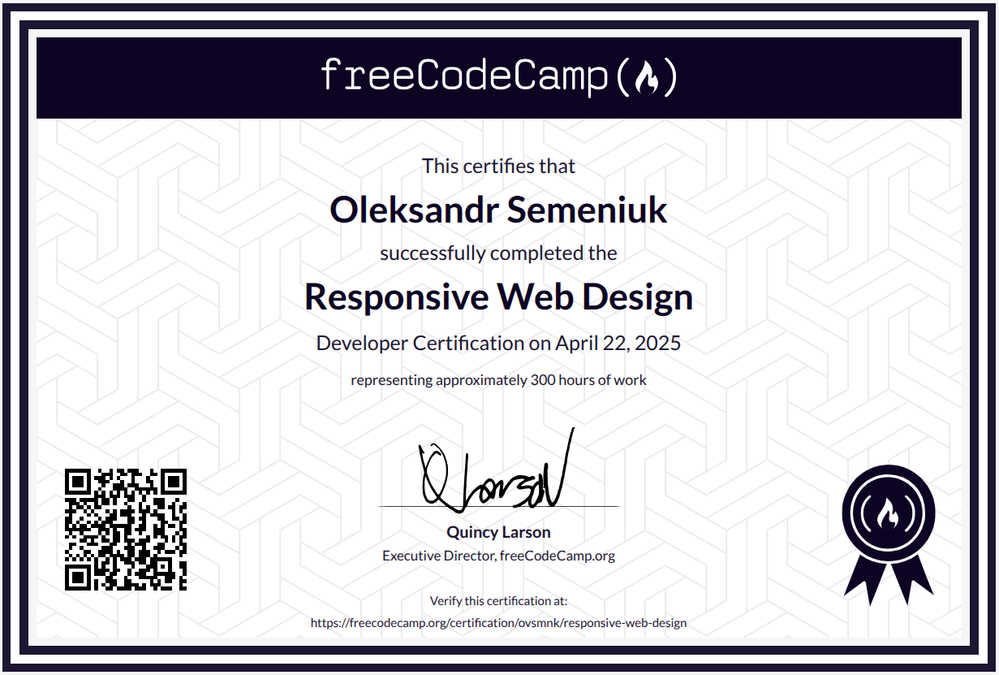

# freeCodeCamp Responsive Web Design Certification Projects

## Certificate

You can view my certification on [freeCodeCamp](https://www.freecodecamp.org/certification/ovsmnk/responsive-web-design).

## Projects

1. [Survey Form](https://github.com/ovsmnk/freecodecamp-responsive-web-design-projects/tree/main/survey-form)
2. [Tribute Page](https://github.com/ovsmnk/freecodecamp-responsive-web-design-projects/tree/main/tribute-page)
3. [Technical Documentation Page](https://github.com/ovsmnk/freecodecamp-responsive-web-design-projects/tree/main/technical-documentation-page)
4. [Product Landing Page](https://github.com/ovsmnk/freecodecamp-responsive-web-design-projects/tree/main/product-landing-page)
5. [Personal Portfolio Webpage](https://github.com/ovsmnk/freecodecamp-responsive-web-design-projects/tree/main/personal-portfolio-webpage)

## License and Credits

These projects were created as part of the [freeCodeCamp Responsive Web Design](https://www.freecodecamp.org/learn/2022/responsive-web-design/) course.

The color palette used in the projects is from the [Catppuccin Palette](https://catppuccin.com/palette/).
